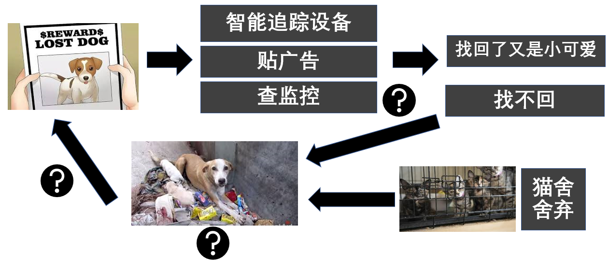
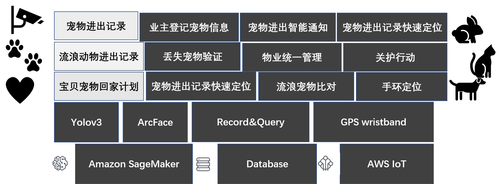
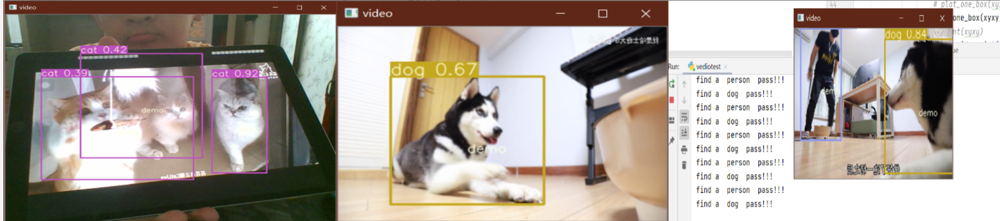
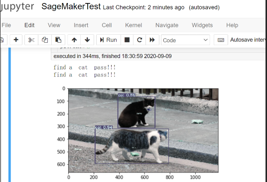

本项目为"Al for Good AWS Hackathon Online 2020" biubiubiu团队的作品SeekPick

## 背景介绍

近年来，可爱的猫猫狗狗等宠物深受人们喜爱，成为人们生活当中的小精灵，小伙伴。宠物的丢失，会对其主人造成极大的困扰。研究科学合理高效的宠物找回系统很好必要。

另一方面，猫舍等机构因繁育选育后品相不佳、身体缺陷、严重基因病、无法售出或价格太低等原因随意丢弃，大学生毕业将宠物丢弃，家庭宠物意外丢失等等原因导致流浪动物激增。而流浪动物进入社区会增加社区内宠物患传染病的几率大大增加，也会加大社区内人群受伤的风险。因此加强社区对流浪动物的管理，变得很有必要。
## 问题分析

1. 宠物丢失后，通过贴广告等传统方法效率低下，且影响城市形象
2. 监控查找效率太低，无法及时定位
3. 流动动物收容中心缺乏科学有效的管理及人性化的收养机制


## 项目构想
本方案从三个切入点出发，结合计算机视觉、深度学习、物联网等技术，着力解决宠物丢失找回，流浪动物监管两大问题。



### **宠物进出记录**
随着目标检测技术的快速发展，yolo、SSD等轻量级目标检测模型可以准确快速的抓取图像中的目标物体。利用现有的监控设备，使用该项技术可以对进出社区的动物进行记录。

近年来，随着计算机视觉技术，特别是人脸识别、人脸比对等技术的发展，对宠物进行脸部辨识成为可能。因此登记宠物信息（面部，体态，品种，性别等），可以为宠物找回提供丰富的信息。结合目标检测技术，可以动物进出记录提供更多的有效信息。

结合以上两种新技术，一方面，当宠物丢失时，社区业主可以在监控处，快速定位宠物外出时间及地点等关键信息。另一方面，在登记宠物信息时，可以登记主人信息，当宠物外出时被识别时，通过比对登记信息，确定宠物主人，以通过预留信息给其主人及时的通知。

结合使用一些IoT设备，在小区入口等位置设置监听设备，可以准确确认宠物身份。

### **流浪动物进出记录**

外来流浪动物对社区影响极大，对外来流浪宠物进行收容等管理是优秀物业服务的体现。利用现有的监控设备，结合目标检测等技术对外来动物进行及时定位，可以快速对其进行抓捕等处理。另外，对可能是原业主丢失宠物的动物，可以及时通知业主认领。对收容宠物动物进行展示，鼓励业主领养也是解决流浪动物这一社会热点问题的有效途径。

### **宝贝宠物回家计划**
当宠物丢失时，准确确定宠物的位置十分关键，利用Amazon IoT提供的GPS定位装置，可以快速对宠物进行跟踪定位。但受限于这一设备的在用户中普及率及服务范围等原因，并不能完全解决找回一问题。
通过切入点一中监控记录，可以及时告知业主，是及时找回宠物的重要措施之一。通过切入点二中对外来动物进行身份识别，也可以帮助找回宠物，另外，如果不幸在长期未能找回宠物，可以在收容记录找外形相似的宠物进行领养，也是慰藉失宠主人的重要途径。

**注：由于开发时间以及开发人员有限，本构想只完成了部分功能**

## 创新点
本项目有以下主要创新点：
1. 整合现有监控设备对进出动物进行监控记录，可以充分利用现有资源。
2. 当登记宠物外出时，及时告知业主，方面快速找回。
3. 有利于加强对流浪动物的监管，实现一个系统多个用途。

## demo演示

### **何如运行demo**
1. 下载预训练权重,放在`cat_dog_detection/coco_cfg`文件夹下
```bash
链接：https://pan.baidu.com/s/18Kwm1sXmSPXmjUWcOoNKdA 
提取码：9j4d
```
2. 进入cat_dog_detection文件夹
```bash
cd cat_dog_detection
```
3. 安装程序运行所必需的package
```bash
pip install -r requirements.txt
```
4.1 运行摄像头demo
```bash
python cameratest.py
```
4.2 运行录像demo
```bash
python vediotest.py
```
4.3 SageMaker测试程序见`cat_dog_detection/SageMakerTest.ipynb`
### **demo展示**



## 团队介绍
本团队（biubiubiu）由一人组成，成员是来自浙江大学的研一学生仉鹏，邮箱:zzhangpeng@zju.edu.cn。

## AWS技术
本项目将得益于Amazon SageMaker提供的高性能GPU服务器，可以快速训练深度学习模型（目标检测yolo，动物面部比对arcface），借助Amazon Database提供的数据库服务对宠物出行记录、宠物登记信息等内容进行存储，使用Amazon IoT提供的GPS定位服务，为宠物进行定位。得益于这些稳定成熟高可靠的产品，项目可以进行快速开发测试。
 