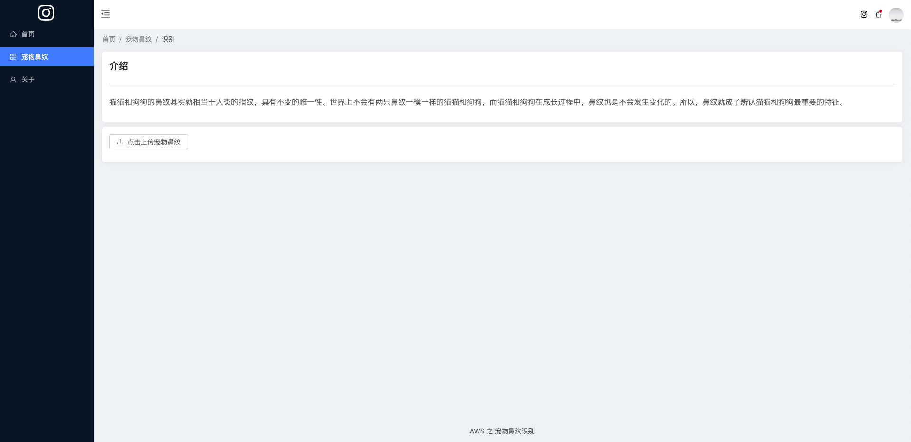
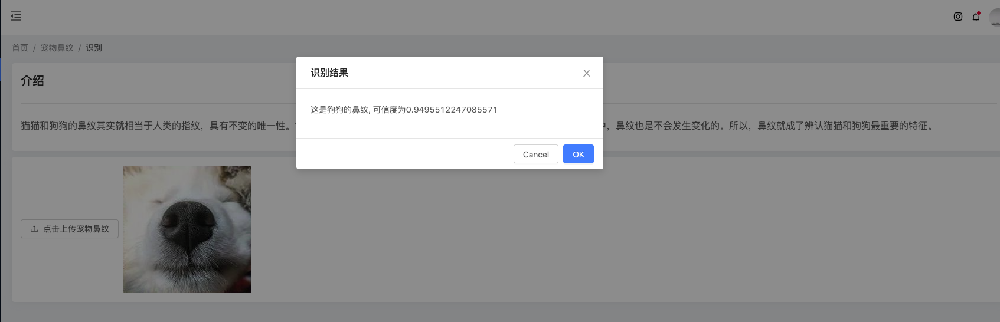
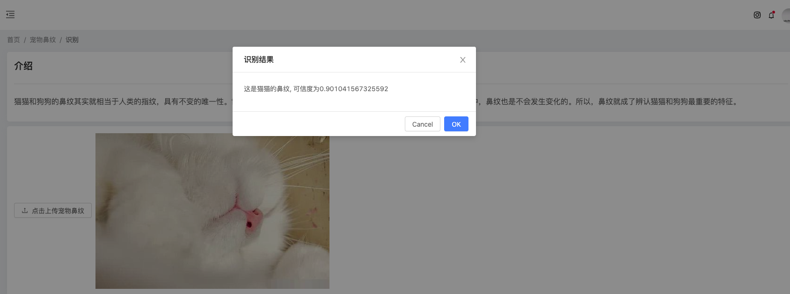

# 宠物之鼻纹识别

## 作品介绍
猫猫和狗狗的鼻纹其实就相当于人类的指纹，具有不变的唯一性。世界上不会有两只鼻纹一模一样的猫猫和狗狗，而猫猫和狗狗在成长过程中，鼻纹也是不会发生变化的。所以，鼻纹就成了辨认猫猫和狗狗最重要的特征。

难点在于数据采集，宠物鼻纹的数据通过自己编写爬虫，爬取百度、搜狗数百张图片进行训练，使用了Python scrapy技术。源代码见baidu_sogou_images目录。

通过使用aws相关技术进行机器学习，同时将模型结果通过react web前端技术展现出来，是的模型得以使用。

## 作品截图

- 首页

  

- 识别鼻纹

  

- 识别鼻纹

  

- 识别鼻纹

  

- 关于作者

  

## 安装、编译指南
- 安装
进入到pc目录 运行`yarn install`

- 运行
在pc目录中运行`yarn start`

- 部署
打包运行命令`yarn build`

pc目录中的testdata目录提供了测试数据

## 团队介绍
我是一名前端工作者，同时对AI有很高的兴趣，非常感谢aws这次举办的比赛

## 使用到的 AWS 技术
- s3

存储数据集

- sagemaker

进行机器学习

- endpoint

部署模型，使得模型得以线上调用

- aws-sdk-js

调用模型
