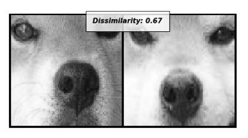
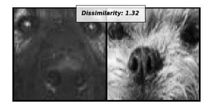
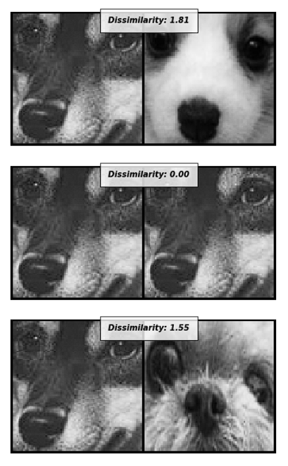

# 赛题一：遗失宠物的智能寻找

作品介绍：
    伴随着人们物质生活水平的提高，越来越多的家庭选择饲养小动物，它们不仅是家庭的宠物，很多人也将他们视作家庭成员之一，给予百般宠爱和呵护。然而即便如此，意外还是难免发生——宠物的意外走失给很多宠物家庭带来了困扰，满大街发传单、贴广告不仅浪费时间，成效也甚微。

作品截图：

注：下图中参数Dissimilarity代表不相似程度，即：此参数数值越低说明两张图片中狗是同一只的可能性更大。

图一：同一只狗对比图

图二：不同狗的对比图

图三：综合情况对比图

安装、编译指南：
    1.使用Siamese-Net-train.ipynb生成net_params.pkl参数文件； 
    2.运行Siamese-Net-test.ipynb中的代码，在其输出中查看结果。
    
团队介绍：
    团队成员：刘增辉 
    联系方式：15166663386

使用到的 AWS 技术：训练过程中使用了Amazon SageMaker服务器，其强大的算力为训练参数节省了大量时间。
