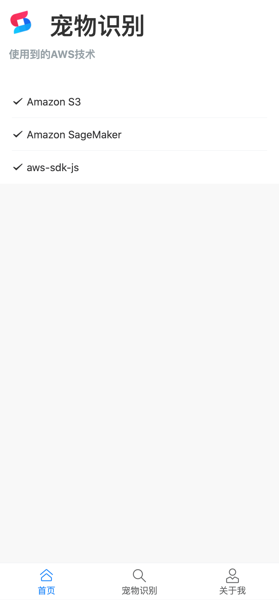
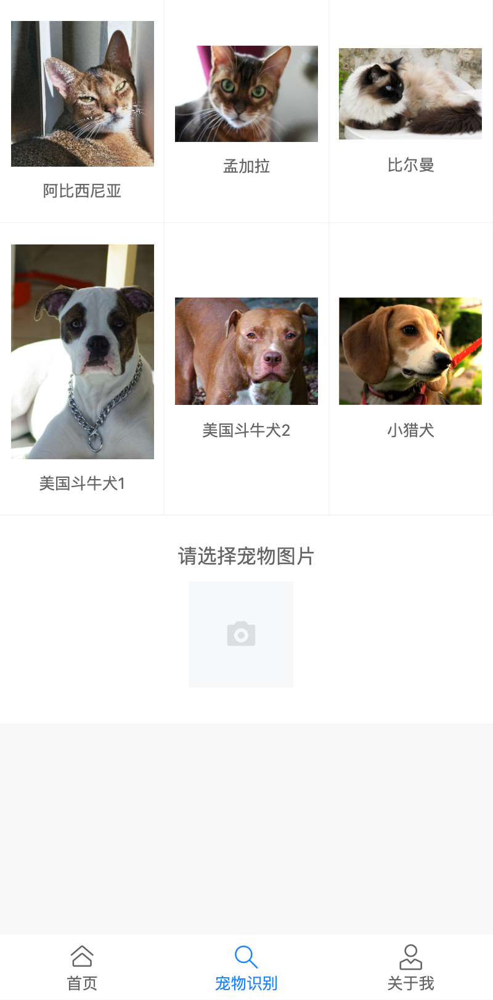
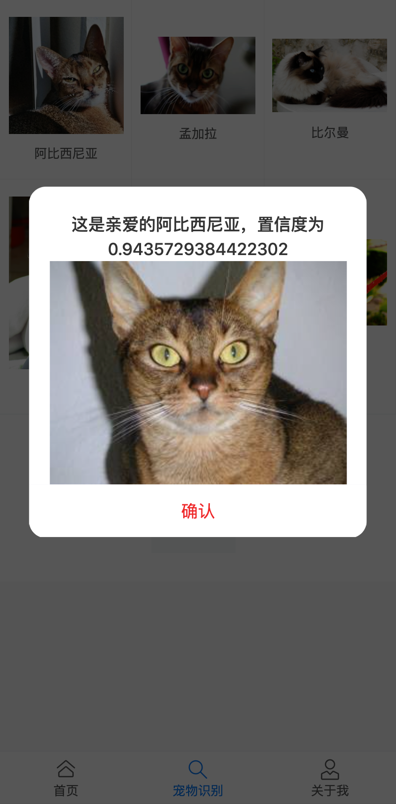

# 宠物识别系统

## 作品介绍
让迷路的小宠物乖乖回家，方便快捷的识别出自家宠物，赶紧带回家。通过vue H5的表现形式使得用户在手机上就可以使用我们的产品，通过调用线上模型进行识别，十分快捷方便。

## 作品截图

- 首页

  

- 识别宠物

  

- 识别效果

  

- 关于我

  

## 安装、编译指南
- 安装
进入到项目根目录 运行`npm install`

- 运行
在项目根目录中运行`npm run serve`

- 部署
打包运行命令
`npm run build`
把dist目录中的文件放到服务器即可

## 团队介绍
热爱编程的小白，觉得能把ai模型运用到web上很满足

## 使用到的 AWS 技术
- s3
- sagemaker
- endpoint
- aws-sdk-js