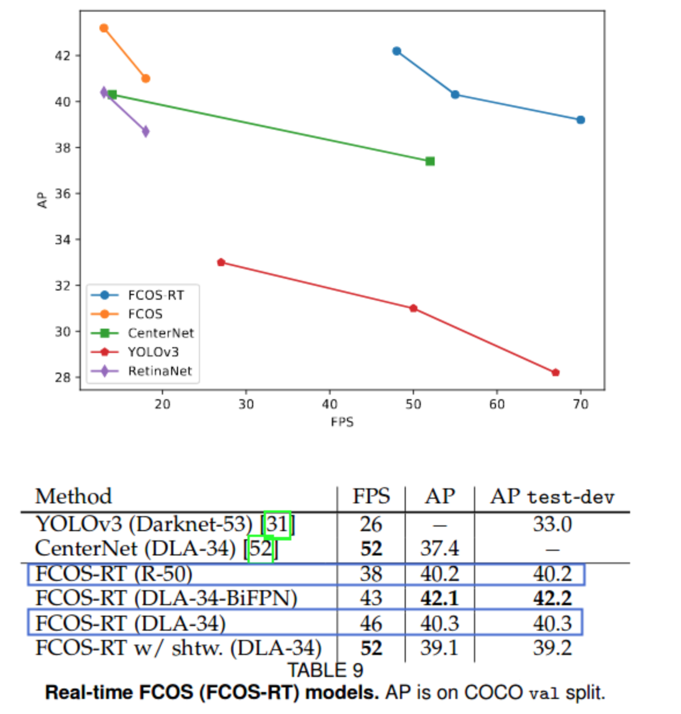
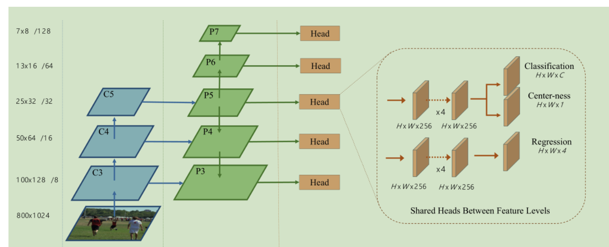
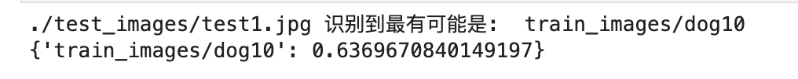
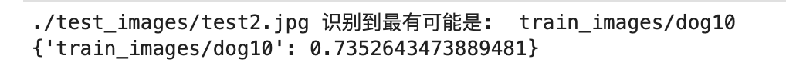
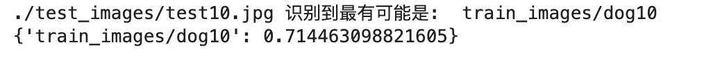

# 赛题一：遗失宠物的智能寻找

作品介绍：伴随着人们物质生活水平的提高，越来越多的家庭选择饲养小动物，它们不仅是家庭的宠物，很多人也将他们视作家庭成员之一，给予百般宠爱和呵护。然而即便如此，意外还是难免发生——宠物的意外走失给很多宠物家庭带来了困扰，满大街发传单、贴广告不仅浪费时间，成效也甚微。

我们使用了更加快速的FCOS进行宠物识别，使用resnet进行宠物相似性比较，下图为FCOS的速度对比，可见使用FCOS后宠物识别速度得到大幅度提升





算法的优势：

- **anchor会引入很多需要优化的超参数， 比如anchor number、anchor size、anchor ratio等；**
- **为了保证算法效果，需要很多的anchors，存在正负样本类别不均衡问题；**
- **在训练的时候，需要计算所有anchor box同ground truth boxes的IoU，计算量较大；**

FCOS属于anchor-free类别的算法，且效果在anchor-free派系中算SOTA了。它的主要优点如下：

- **因为输出是pixel-based预测，所以可以复用semantic segmentation方向的相关tricks；**
- 可以修改FCOS的输出分支，用于解决instance segmentation和keypoint detection任务；


作品截图：

安装、编译指南：

(1)解压预训练模型

```
! cd ~/work; ./FCOS_pretrained.zip
! cd ~/work; unzip FCOS_pretrained.zip
! cd ~/work; rm -f FCOS_pretrained.zip
```

(2)导出模型

```
! cd ~/work; python model.py --config=2
```

**注意:**

- config=2表示使用的是配置文件fcos_rt_dla34_fpn_4x.py，config=1表示使用的是配置文件fcos_rt_r50_fpn_4x.py，config=0表示使用的是配置文件fcos_r50_fpn_multiscale_2x.py；train.py、demo.py、eval.py中同样有这个命令行参数；
- 导出后的模型放在inference_model/目录下，里面有一个infer_cfg.yml配置文件，是导出后的模型专用的。如果你要修改target_size、max_size、draw_threshold等参数，直接编辑它并保存，不需要重新导出模型

(3)使用模型预测图片、获取FPS

In [ ]

```
! cd ~/work; python deploy_infer.py --model_dir inference_model --image_dir images/test/
```

## 训练

那么需要先解压数据集

https://www.kaggle.com/tongpython/cat-and-dog

我们使用了kaggle上的宠物训练集

然后运行ipynb文件开始训练


团队介绍：林子豪 联系方式：13385081586


使用到的 AWS 技术：使用了Amazon SageMaker 服务，平台的高性能GPU使得借助这个平台让我更快速的训练模型

