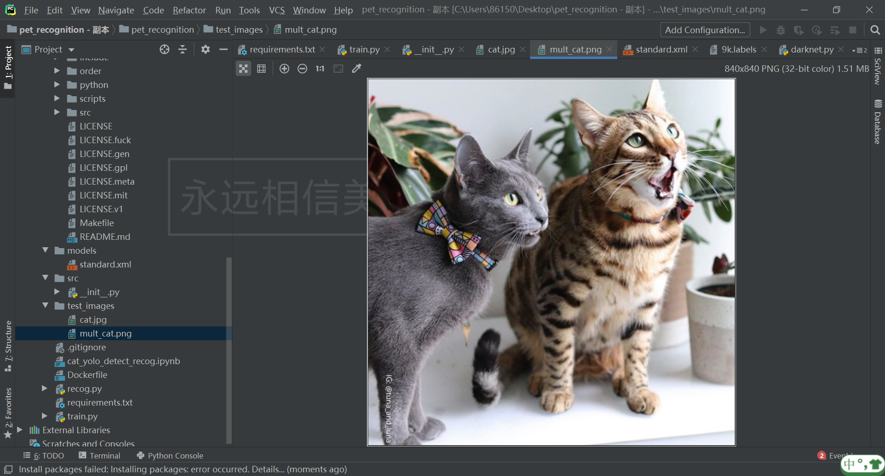

# 团队简介：

团队名：元组

团队成员均为传智专修学院在校学生，基础编程能力扎实，团队协同一心，有着高效的问题解决能力，对工智能，机器学习有相应的理解与编码能力。

联系方式：

电话：杨：15779506628   廖：15008167363

邮箱：avenir157@163.com

# 项目介绍：

本项目是一个猫脸识别的案例，通过已经训练好的模型检测已存在的猫咪图片，用卷积神经网络做对图片做回归算法，提其特征，获取猫脸的花纹的主要关键点，识别出是哪一只猫，本模型可以用于走失小猫的检测与寻找。

# 项目截图：

### 项目截图1

### 项目截图2

### 

项目截图3

