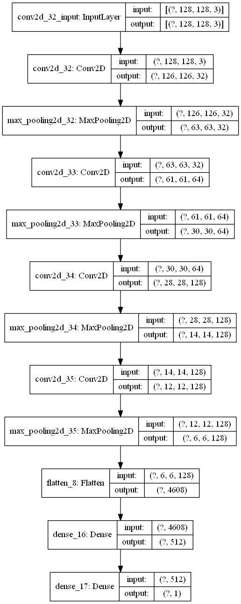

# 遗失宠物的智能寻找

## 1.作品介绍：

伴随着人们物质生活水平的提高，越来越多的家庭选择饲养小动物，它们不仅是家庭的宠物，很多人也将他们视作家庭成员之一，给予百般宠爱和呵护。然而即便如此，意外还是难免发生——宠物的意外走失给很多宠物家庭带来了困扰，满大街发传单、贴广告不仅浪费时间，成效也甚微。
作品使用猫脸识别对遗失宠物智能寻找。

## 2.作品截图

### 2.1 训练模型



### 2.2 训练结果


## 3.安装、编译指南

使用Anaconda3集成开发环境，直接运行.ipynb文件即可。

## 4.团队介绍

范玉兴 
联系方式：17852835289

## 5.使用到的 AWS 技术

使用了Amazon SageMaker 服务


```python

```
