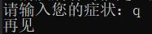

# 基于决策树的智能初诊程序

## 介绍：

通过症状表现对疾病进行初步的判断的程序

## 截图：

## 安装使用：

1. python3环境

2. `pip install -r requirements.txt`

3. python main.py

## 团队介绍：

队名：究极划水摸鱼队

团队成员：郭天宇

联系方式：anoncomment@126.com

## 使用的AWS技术：

使用Amazon SageMaker创建训练模型