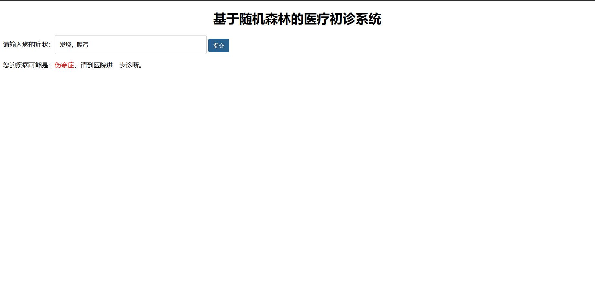
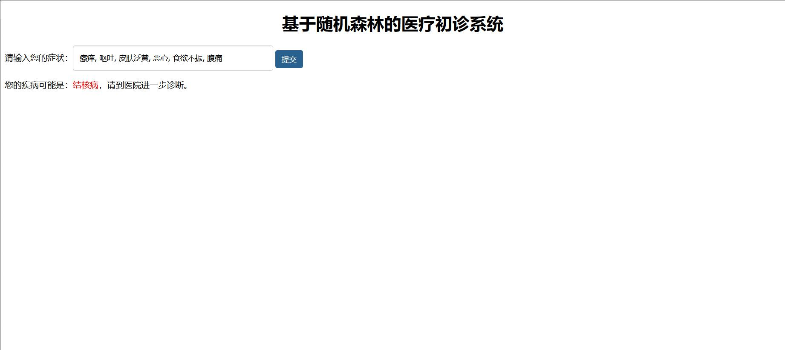
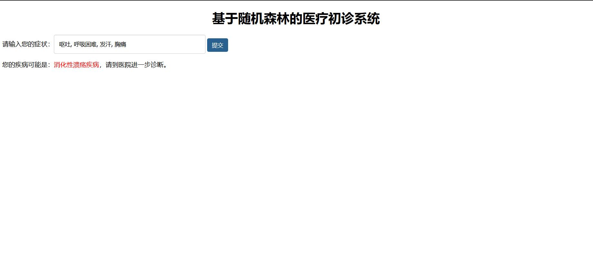

# 基于随机森林的医疗初诊系统

### 系统介绍：

web平台

输入症状

输出可能的疾病

### 截图展示：

### 安装使用：

安装requirements.txt依赖，运行app.py，访问127.0.0.1:5000

### 团队介绍：

团队名称：吃个面包压压惊

团队成员：刘伟

联系方式：liuliuwei666666@163.com

### AWS技术：

使用Amazon SageMaker训练模型