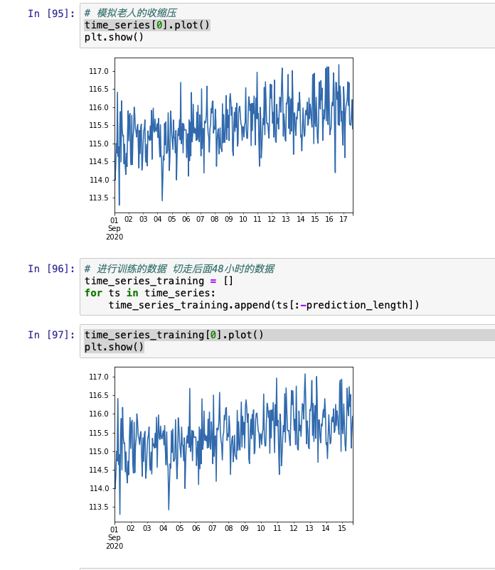
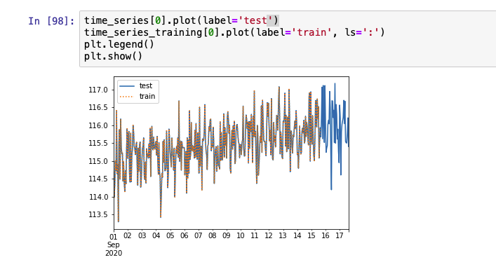
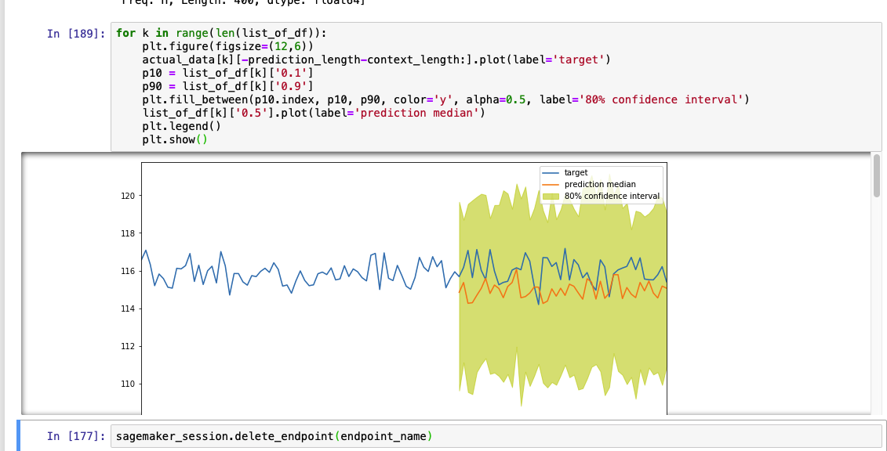
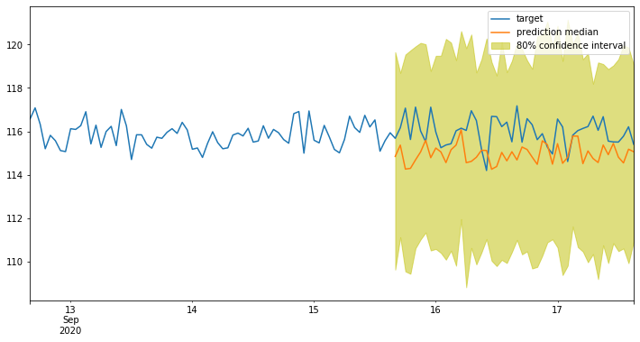

# 老人血压健康监控预测

## 作品介绍

关于老年人血压控制“高一点”还是“低一点”的话题，一直都是人们争论的焦点。在临床上，正常成人收缩压为90-139毫米汞柱，

无人陪伴、远在家乡、健康意识落后等问题普遍存在于这一代中老年群体中，利用此作品对老年人的血压健康进行监控预测，给老年人的健康保健服务带来有力的保障。

利用AWS SegaMaker的内置算法DeepAR进行机器学习，同时利用aws部署模型，调用线上模型，预测老人的后两天血压。

## 作品截图

- 全部数据以及训练数据

  

- 训练数据与测试数据展示

  

- 构建模型

  

- 预测结果

  

  

## 安装、编译指南
- 安装、运行
直接在aws的segamker服务中的笔记本实例中新建实例，把lpr.ipynb复制粘贴进去即可运行

## 团队介绍
本团队为一个人，在校学习过Python，联系邮箱：1067537312@qq.com

## 使用到的 AWS 技术
- s3
- sagemaker
