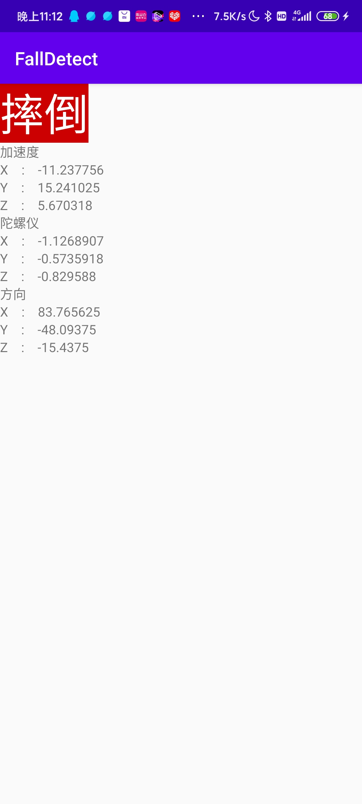
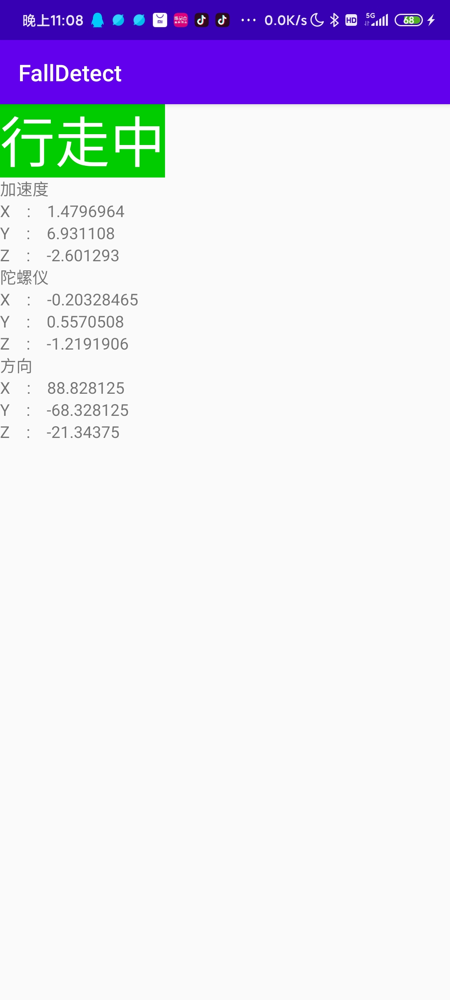

# 跌倒报警器 - 啦啦队

## 作品介绍
跌倒是全球老人意外伤害的头号杀手。数据显示，我国60岁以上的老人中，每年因跌倒造成伤害的达2500万人。跌倒后如果不及时急救，很容易有生命危险，那老人跌倒怎么办呢？本项目基于智能手机传感器获取加速度、角速度和偏向角的数据，并通过深度学习算法进行序列数据分类，识别出老人跌倒的情况。当出现意外情况，可以向预先设置的号码求救。也可以通过手机定位功能报告精确的位置方便急救人员快速到达现场。

## 作品截图

## 实现过程

### 收集数据
使用公开的mobifall数据集，共包含1442个片段，每个片段包含一段时间的传感器数据。传感器数据包括加速度传感器、方向传感器和角速度传感器。

### 训练深度学习模型
搭建LSTM模型用于时间序列数据，将传感器数据序列分类成正常行走和跌倒两种标签。

### 开发安卓应用程序
开发安卓应用程序获取传感器数据。将tflite模型部署到手机上并进行实时推理，当判断跌倒后发送http请求报警。

## 团队介绍
[朱融晨](mailto:zrcccrz@outlook.com)

## 使用到的 AWS 技术
使用 sagemaker 训练深度学习模型