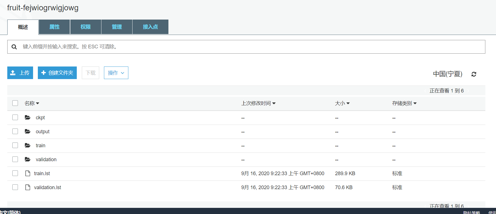
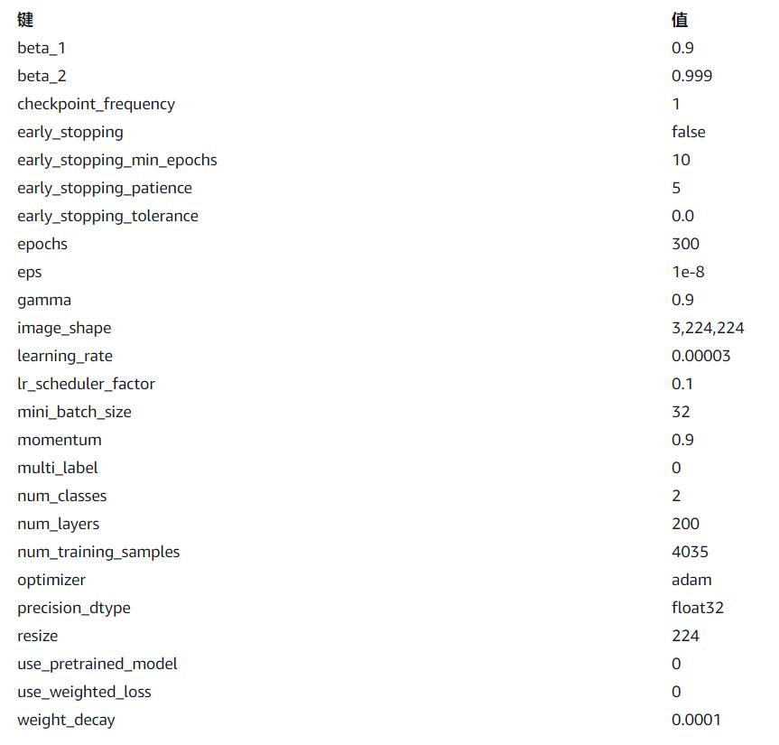
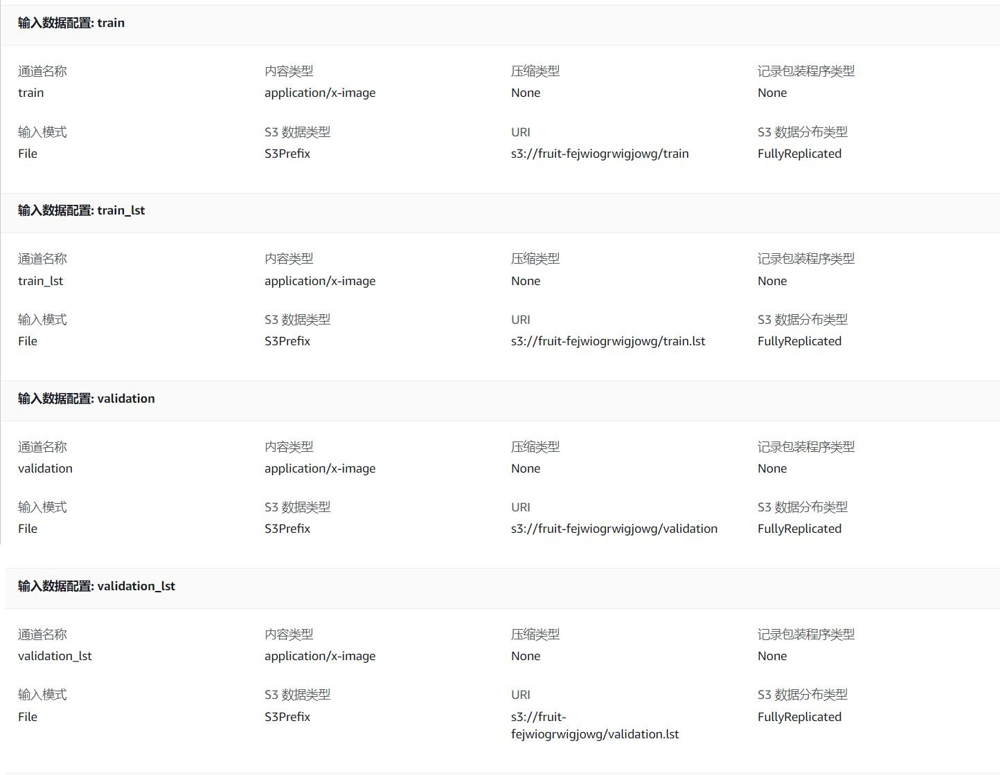
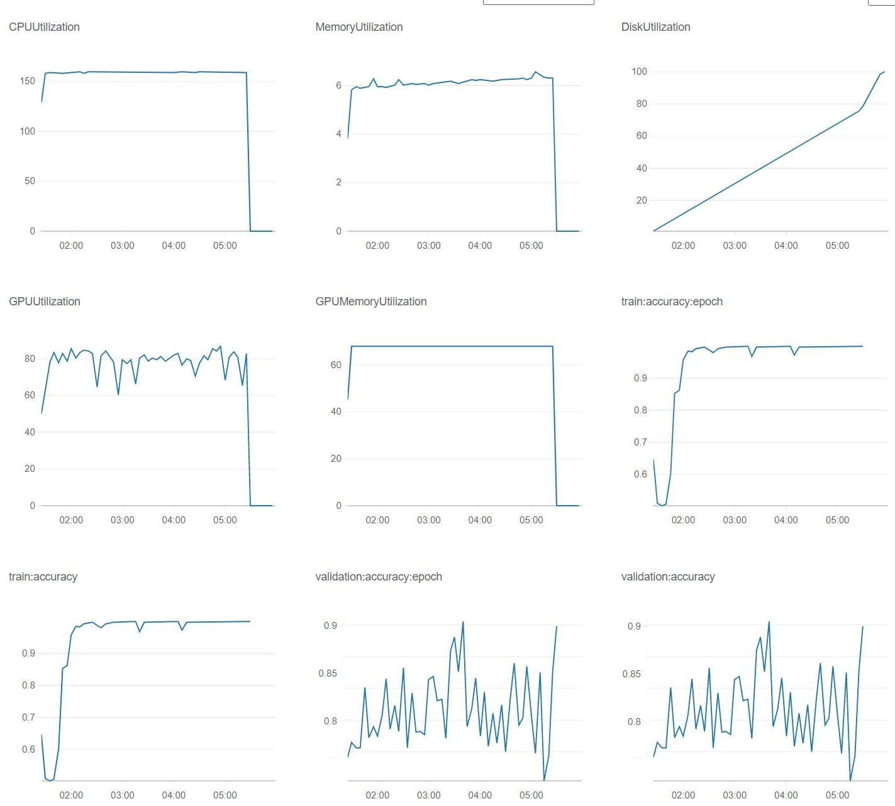
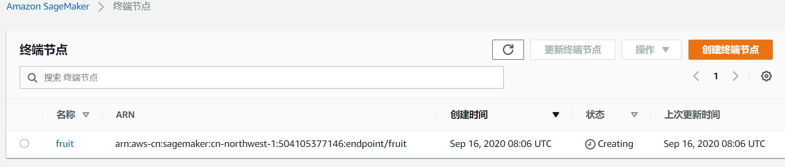
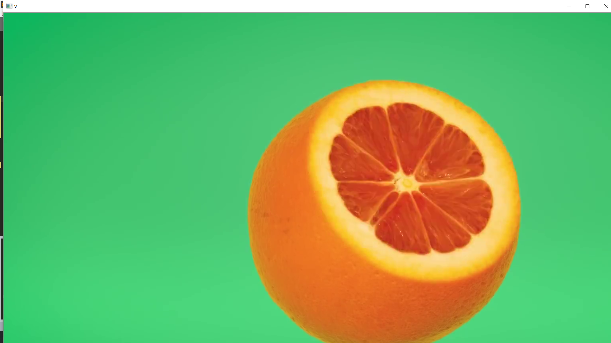

# 果识 - 乌兹到底行不行

## 作品介绍

通过AWS SagerMaker训练图片分类模型并部署。使用opencv调用摄像头获取图片，使用boto3调用endpoint部署的算法。

## 使用的AWS服务和技术

* 将训练数据上传到 AWS S3
* 使用SageMaker 训练任务 训练图片分类模型
* 使用SageMaker Endpoint 部署模型
* 使用开发工具包 boto3 调用模型

## 实现过程

### 数据来源
[水果图片数据集](https://www.kaggle.com/sriramr/fruits-fresh-and-rotten-for-classification)

共包括3种新鲜水果和3种腐烂水果

### 训练图片分类模型

### 调用摄像头获取图片并分类

## 贡献者名单及联系方式
孙东牛 1254750354@qq.com
