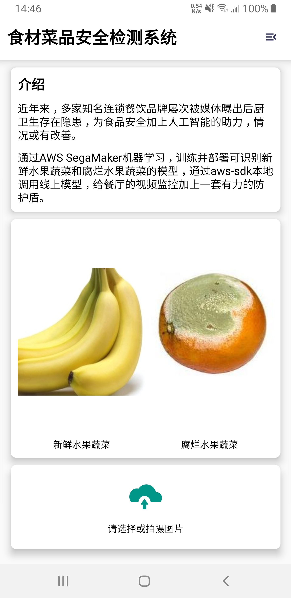
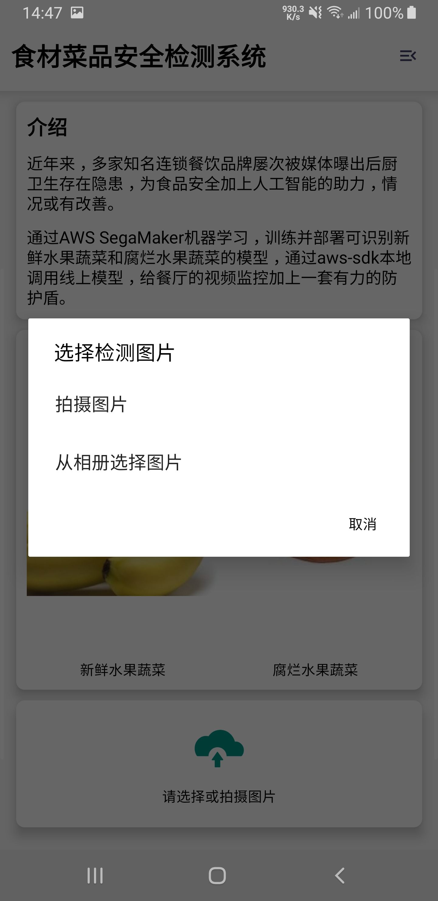
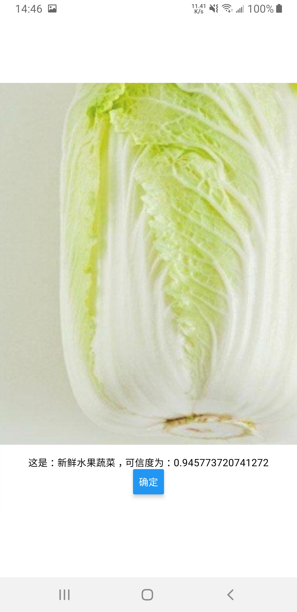
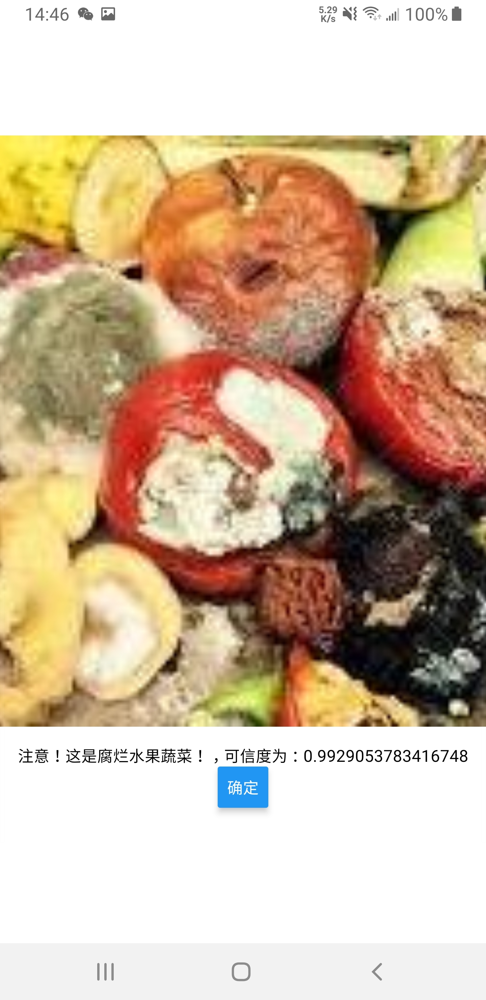
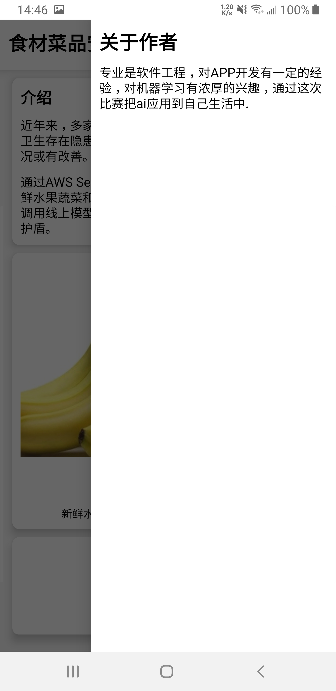

# 食材菜品安全检测系统

## 作品介绍

近年来，多家知名连锁餐饮品牌屡次被媒体曝出后厨卫生存在隐患，为食品安全加上人工智能的助力，情况或有改善。

通过AWS SegaMaker机器学习，训练并部署可识别新鲜水果蔬菜和腐烂水果蔬菜的模型，通过aws-sdk本地调用线上模型，给餐厅的视频监控加上一套有力的防护盾。

## 作品截图

- 首页

  

- 选择图片

  

  

- 识别结果

  

  

- 关于作者

  

## 安装、编译指南
- 安装
进入到根目录 运行`yarn install`

- 运行
在根目录中运行`yarn android`

- 打包apk

打包运行命令

进入到android目录 运行
`./gradlew assembleRelease`

test目录中图片为测试数据

## 团队介绍
本人专业是软件工程，对APP开发有一定的经验，对机器学习有浓厚的兴趣，通过这次比赛把ai应用到自己生活中.

## 使用到的 AWS 技术
- s3

存储数据

- sagemaker

机器学习

- endpoint

部署模型

- aws-sdk-js

调用模型
