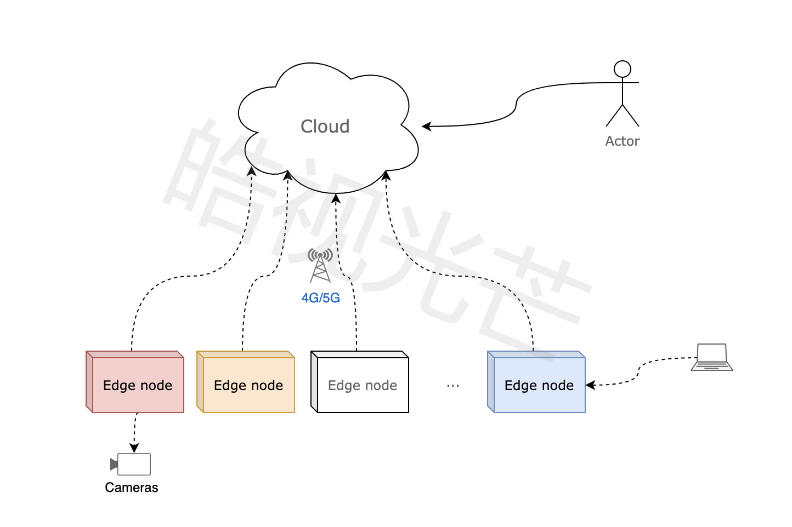
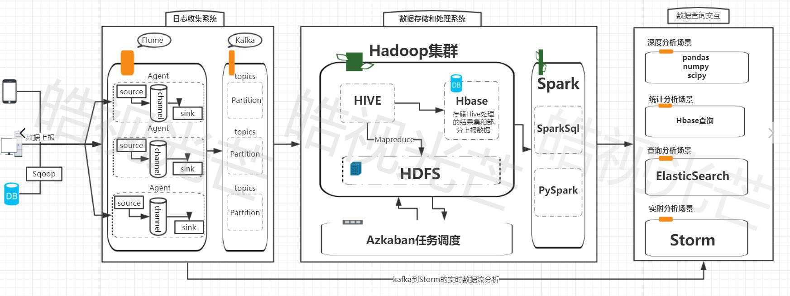
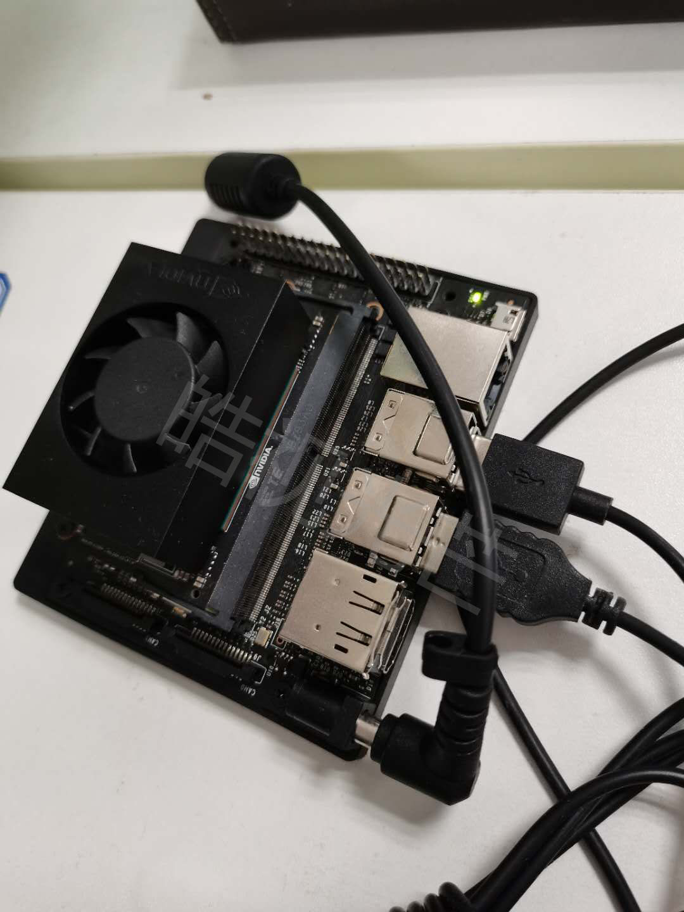
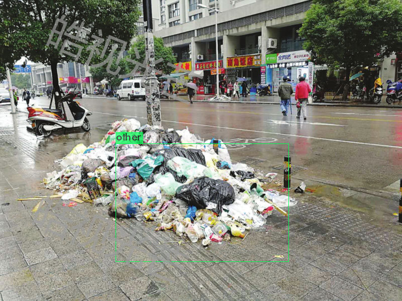
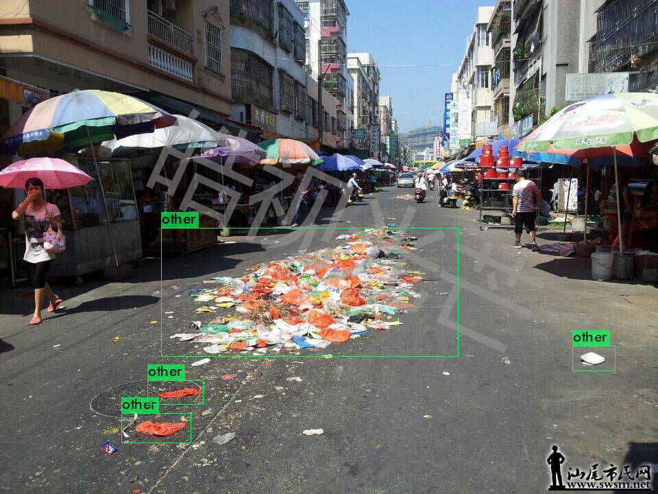
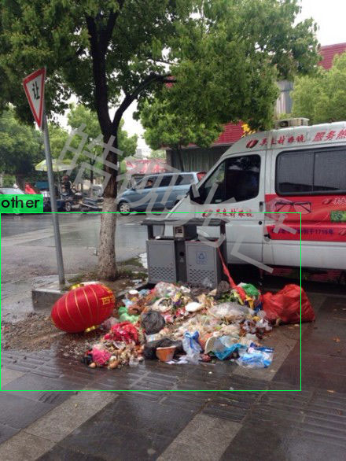

# 城市道路垃圾实时监测系统(Garbage AI Finder)

## 作品介绍
### 警告:该作品中图片,文字,代码均由皓视光芒团队为本次大赛原创,本团队对作品享有著作权。严禁其它任何个人或组织私自未经许可使用,如需使用请联系队长。
随着人类活动和城市化进程，垃圾随之源源不断的产生，据悉“每人每天产生约1KG的生活垃圾，一个城市每天产生万吨级的垃圾”，垃圾与环境矛盾日益突出。
城市道路垃圾是城市管理者投入的重点，维护良好市容市貌需要投入大量的人力物力，并面临以下问题和挑战：
1. 部分垃圾得不到及时处理。固定时间清扫周期空隙之间，垃圾得不到处理。
2. 环卫资源运转低效。清扫时几乎没有垃圾，或者垃圾很多清扫车不能及时调度。
3. 环卫工作外包模式，也存在监督与反监督隐形成本。

垃圾的产生是随机的，但清扫时间是相对固定，如何按需调度清扫资源？如何更高效利用清扫资源？
我们提出基于机器视觉+大数据的方案，实现垃圾的实时监测，主要包含以下几个方面：
1. 图像+GPS位置信息作为基本输入单元，以便业务端生成垃圾分布热图等诉求；
1. 采用边缘检测+云端检测两种接入方式。对于移动车载巡检车采用边缘检测，结果通过蜂窝方式上传云端，减少传输成本和计算实时性；对于固定摄像可采用云端检测，减少初次投入成本。
1. （Todo）为了应对N多边缘节点管理运维诉求，方案采用kubeedge统一管理边缘和云端节点；
1. （Todo）提供开放接口，支持第三方通过手机APP等自有方式提供数据上报服务，为众包模式的垃圾上报提供支撑。
1. （Todo）垃圾48小时预报，根据历史数据预测未来48小时的“垃圾预报”。
1. （Todo）扩展垃圾识别场景，比如公园垃圾、绿化带垃圾、水面垃圾等；
1. （Todo）以清扫调度诉求为前提，对垃圾类别识别，实现垃圾分类。

本次实现方案核心部分，即城市道路垃圾识别。

大数据部分，根据边缘对道路垃圾的识别数据，实时做出垃圾地点时间等分布热力图：

实现本次方案的AI边缘计算设备：NVIDIA JETSON XAVIER

## 作品截图
（3张截图+1个视频demo）

视频在根目录下的show_detected.mp4，此视频是实拍视频。

## 安装编译
1. 本次项目代码主体使用语言为python,所以需要安装python3.6.9。
1. 机器学习框架使用的tensorflow2。
1. 用pip安装requirement.txt文件中的所有第三方库。
1. 大数据部分使用的是hadoop + spark + zookepper + hbase + elasticsearch + kibana + kafka
本次大数据使用docker镜像搭建，镜像地址：https://hub.docker.com/repository/docker/minokun/hadoop_single
1. 使用命令：请联系团队负责人。

## 团队成员
- Tony : 队长
- Eric : 产品经理
- Chandler : 算法工程师
- Simon : 大数据工程师
- Alex : 算法工程师
- 队长联系方式: 13060029781

## 使用到的AWS技术
- Amazon EC2
- Amazon S3
- Amazon SageMaker

## 问答
1. 垃圾是如何定义的？
答：在道路具体场景下，道路异物即为垃圾，路面、两侧垃圾桶、树木、道路标示线、物体影子、行人车辆等是正常存在，除此之外物体即为垃圾
1. 垃圾如何去重？
答：利用物体运动轨迹检测来判断一段时间内是否为同一个垃圾
2. 垃圾的度量？
答：利用激光测距和图像识别框的大小，使用仿射变换等相关算法，计算出真实场景下的垃圾覆盖面积。
3. 光线较暗的视频增强
答：在雾天，晚上等光线较暗的情况下，使用图像增强算法来对图像做第一阶段处理。
