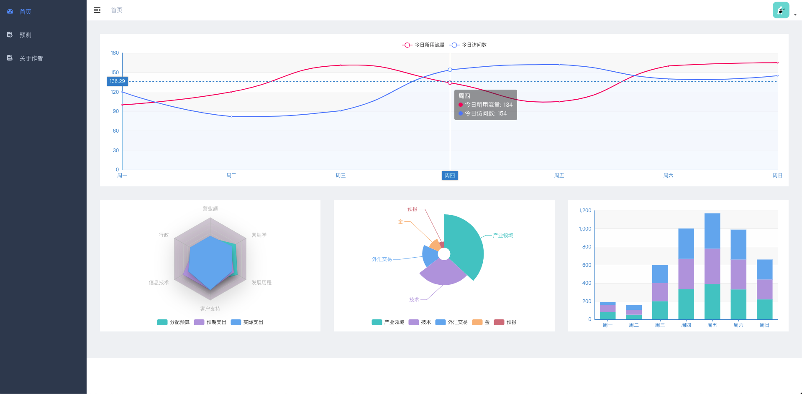
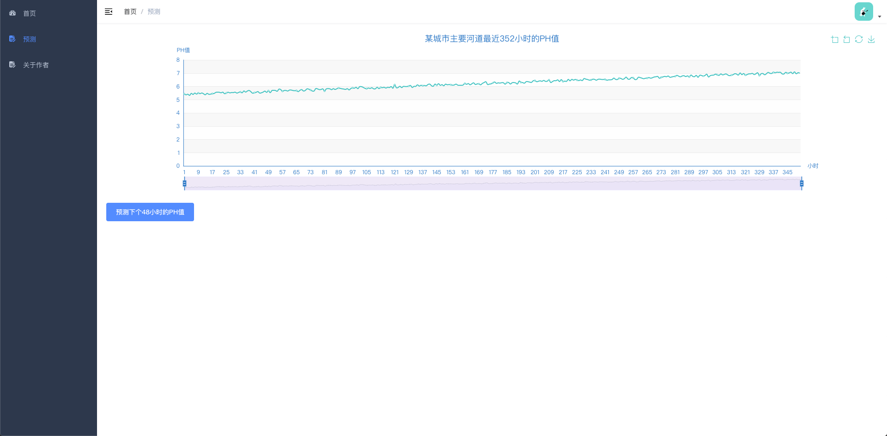
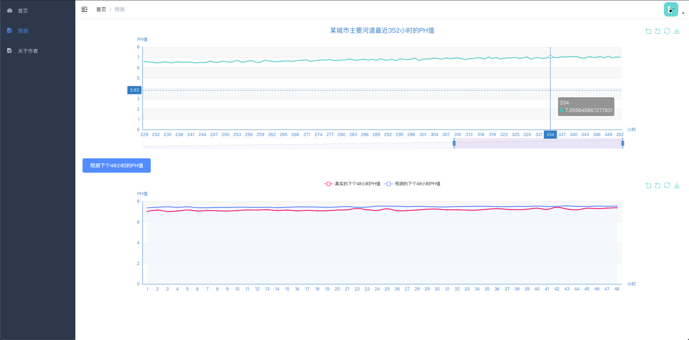
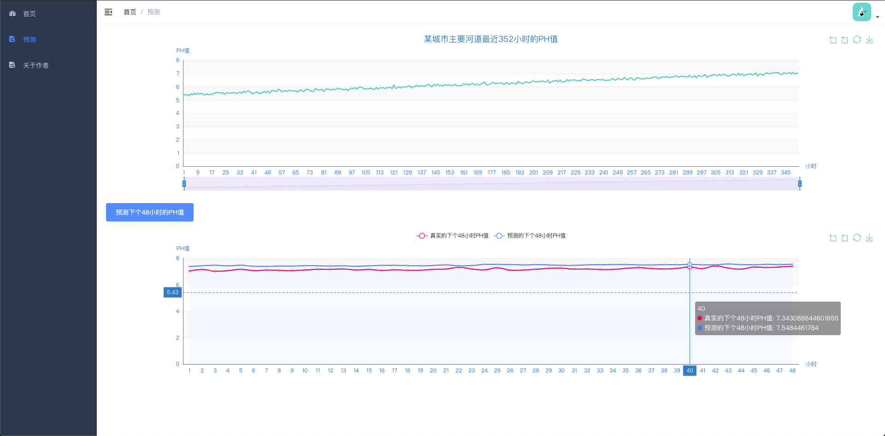
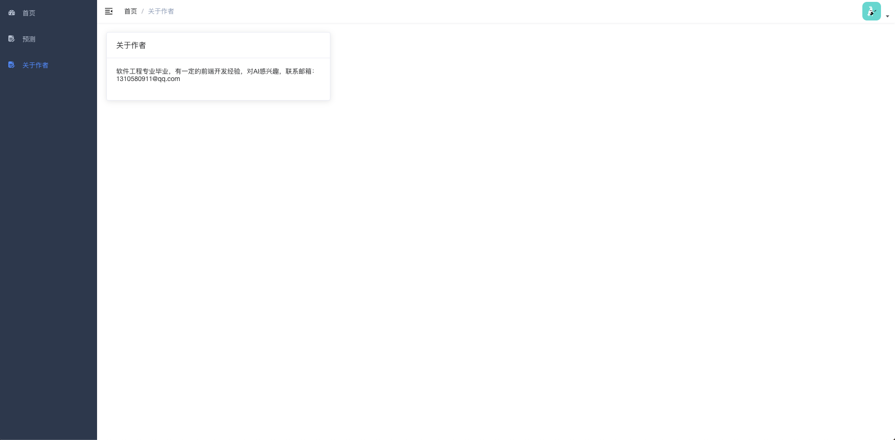

# 城市水源质量预测

## 作品介绍

通过使用人工智能技术为城市环境污染进行实时的监控和预测，其中城市水源质量就是重要的一环，例如城市主要河道的PH值是否在正常范围内，PH值过高或者过低则意味着河道受到了工厂排污水污染，导致河流变酸河。

本作品使用AWS SegaMaker进行机器学习，训练并部署可预测河流下一48小时内的PH值的模型，通过aws-sdk-js本地调用线上模型。

## 作品截图

- 首页

  

- 预测

  

  

  

- 关于作者

  

## 安装、编译指南
- 安装

进入到根目录 运行`npm install`

- 运行

在根目录中运行`npm run dev`

- 打包

在根目录中运行`npm run build:prod`

## 团队介绍
软件工程专业毕业，有一定的前端开发经验，对AI感兴趣，联系邮箱：1310580911@qq.com

## 使用到的 AWS 技术
- s3

存储数据

- sagemaker

机器学习

- endpoint

部署模型

- aws-sdk-js

调用模型
