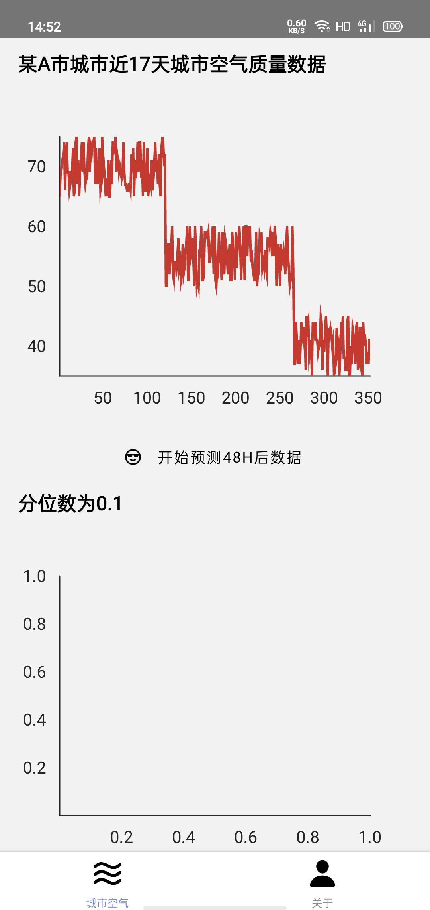
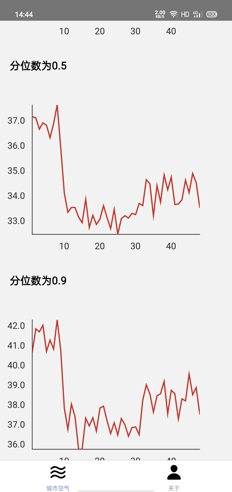

# 城市空气质量预测

## 作品介绍
地球是我们赖以生存的环境，近年来，随着人工智能、大数据、云计算等技术的成熟，环保领域正向智能化转变。

通过过去17天的城市空气质量数据，通过aws的DeepAr算法进行训练模型，预测下个48H的空气质量。做到“未病先知，未病先治”，进一步改善环境污染。

把预测出来的数据通过APP展现给用户，使得模型得以方便使用。

## 作品截图

- 首页

  

- 预测

  

- 关于

  

## 安装、编译指南
- 安装
进入到项目目录 运行`yarn install`

- 运行
在项目目录中运行`yarn start`

- 部署
打包运行命令`yarn build`

## 团队介绍
计算机科学与计算专业出身，对编程较为熟悉，对能让AI应用到生活中有浓厚的兴趣，联系邮箱：614766037@qq.com

## 使用到的 AWS 技术
- s3

- sagemaker

- endpoint

- aws-sdk-js

