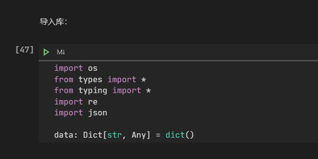
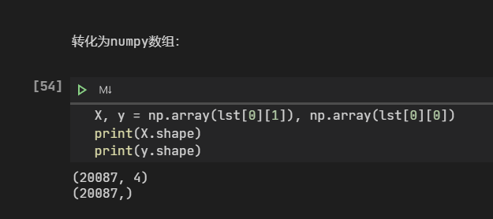
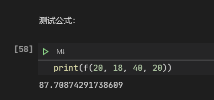

# 空气污染状况的预测

## 应用场景

空气污染状况愈发严重，这种情况需要公众的重视。本项目使用 `sklearn` 以及 `Amazon SageMaker` 等工具预测城市空气污染状况。

在这里选择北京市的空气质量数据和全国的天气气象数据。这里选取与空气质量有关的四个参数：每小时的空气温度，露点温度，风向角度，风速。

详细请见 `pyDl.ipynb`

数据来自于[这里](https://quotsoft.net/air/)

## 安装指南

```
pip install -r requirements 
```

## 截图








## 团队：wesdrtfg

成员： yxa2111

联系方式： 

email: yxa2013@outlook.com 

QQ: 2518340084

## 使用到的AWS技术

 `Amazon SageMaker` 